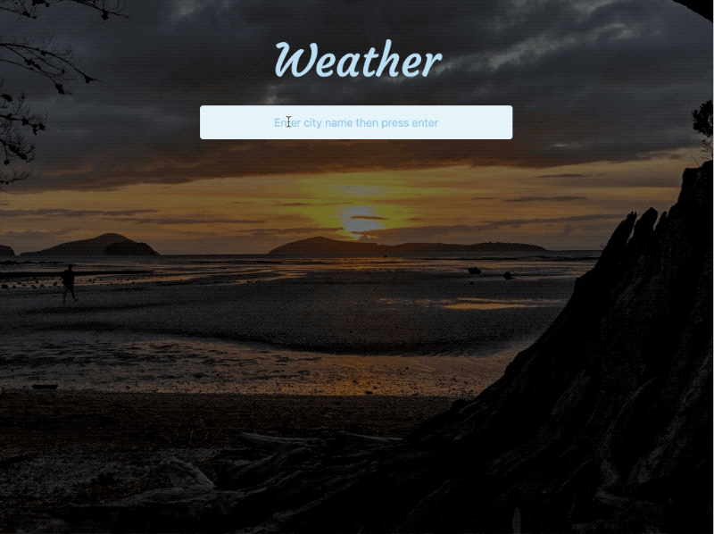

# LiveWire Examples

This repo contains a list of simple examples demonstrating [Livewire](https://livewire-framework.com/) by [Caleb Porzio](https://twitter.com/calebporzio).

### Neon Demo

A simple demonstration of an image being replaced inline when clicked, without any custom JavaScript.

### Weather Demo

A demo showing weather data pulled from the [https://openweathermap.org](https://openweathermap.org) API by Guzzle (on the server side) and then being injected in the front-end without any custom JavaScript.

